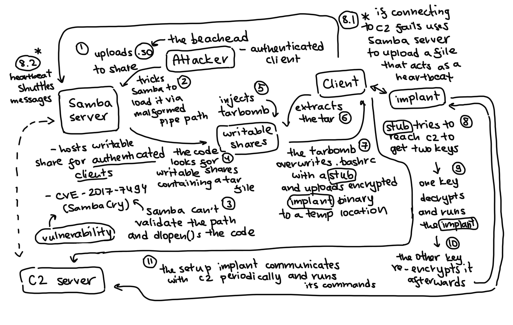

# CS564 Project

**Team:** Pacebreakers

**Members:**
- Ayush Ravi Chandran
- Joyce Werhane
- Amy Chang
- Joe Lebedeva

## Threat Model & Attack Flow



## Environment & Assumptions

Our target is an office network that utilizes a Samba file server to share files between systems. We aim to infiltrate the system and obtain important files and credentials.

- Target OS: Ubuntu 16.04 or similar
- Samba version: 4.6.4 or earlier
- Attacker is an authenticated client on the network with access to a writable share

In our hypothetical situation, we are a worker gone rogue attacking our office network. Our goal is to infiltrate the office's system and obtain important files and credentials stored within workers' machines.

## Vulnerability — CVE-2017-7494 (SambaCry)

Samba versions before 4.6.4 on Linux systems with writable shares fail to properly validate Windows Named Pipe paths, allowing path traversal to arbitrary filesystem locations. Since Samba typically runs with elevated privileges, any code it loads inherits those privileges.

**Trigger:** attacker must be an authenticated client with access to a writable share.

## Exploit Chain

1. Attacker uploads a malicious `.so` file to a writable Samba share
2. Attacker sends a request with a Windows Named Pipe path that traverses to the uploaded `.so`
3. Vulnerable Samba doesn't validate pipe paths — server follows the traversal
4. Samba calls `dlopen()` on the `.so`, executing attacker code with Samba's privileges
5. Samba server implant finds a writable share with a tar file and injects tar entries (relative paths)
6. Clients extracting the tarbomb get a bash stub + encrypted binary implant dropped into their filesystem
7. Bash stub activates on interactive shell open — connects to C2 to receive decryption keys
8. Implant decrypts, executes, and re-encrypts itself, then beacons to C2
9. Client implants unable to reach C2 directly use connected implants as gateways; Samba server implant performs routing

## Privilege Escalation

Root privilege is gained through a race condition in `PTRACE_TRACEME` (CVE-2019-13272). When a child process calls the function, the kernel checks the parent's credentials — a race condition allows those credentials to be swapped before the check completes.

## Implant Components

**Server Implant (`sambatest.cpp`)** — runs on the Samba server after SambaCry exploitation. Parses `smb.conf` to find writable shares, scans for tar files, and injects malicious tar entries (tar slip) with relative paths that overwrite `~/.bashrc` on client extraction. Implements a mesh routing scheduler: tracks client nodes via file-based channels (`smb.ini`, `smbclient.ini`, `smblib.ini` in each share path), routes jobs between nodes, and promotes connected clients to gateways for unreachable peers.

**Client Implant (`modulepoc.cpp`)** — dropped onto client machines via the tarbomb. Beacons to the C2 HTTP server using XOR+base64 encoded commands (`X-Id` header for session tracking). Supports: `EXECUTE_COMMAND`, `RECON`, `EXFIL`, `FIREFOX_EXFIL`, `PASSWD_EXFIL`, `SELF_DESTRUCT`, `SHUTDOWN`, `SLEEP`. Installs to `/usr/bin/dbus-sync`. Cross-platform (Linux/Windows).

## C2 Infrastructure

### The Implant

The implant installs itself as `/usr/bin/dbus-sync` (disguised as a D-Bus daemon) with SysV init.d persistence. It beacons outbound to the C2 over TLS port 443 at randomized intervals (4–12 seconds). All traffic is encrypted — RSA-2048 ephemeral key exchange + AES-128-CBC (Fernet) + XOR obfuscation. Exfil uses a separate channel on port 9443 with rolling XOR + base64 encoding.

### C2 Commands

| Command | What it does |
|---|---|
| HEARTBEAT | Keepalive check |
| SYSINFO | Hostname, OS, user, IP, uptime |
| RUN_CMD | Execute shell command, return stdout/stderr |
| RECON_BUNDLE | Full recon: processes, users, SUID bins, crontabs, env |
| EXFIL_FILE | Read any file → POST to exfil server |
| SHADOW_EXFIL | Exfil `/etc/shadow` |
| FIREFOX_EXFIL | Steal Firefox saved passwords |
| DELETE_FILE | Remove a file on target |
| DESTROY | Self-destruct: wipes binary, persistence, logs, history |
| SHUTDOWN | Disconnect session (implant reconnects after jitter) |

## Build & Run

**Prerequisites:** Docker, Docker Compose

```bash
# 1. Set operator token
export OPERATOR_TOKEN=mysecrettoken

# 2. Build and launch all services
docker compose up --build
```

Once an implant connects, run the operator console:

```bash
OPERATOR_TOKEN=mysecrettoken python op.py
```

For an automated full-chain demo:

```bash
OPERATOR_TOKEN=mysecrettoken python op.py demo
```

**Without Docker:**

```bash
pip install -r requirements.txt
python c2_server.py       # terminal 1
python exfil_server.py    # terminal 2
python op.py              # terminal 3 (after implant connects)
```

### Building the Implant Binary

Must be compiled on Linux:

```bash
pyinstaller --onefile --strip --name dbus-sync \
    --hidden-import ssl --hidden-import _ssl \
    --collect-all cryptography \
    --runtime-tmpdir /tmp/.cache \
    implant_client.py
cp dist/dbus-sync staging/dbus-sync
```

## Ports

| Port | Service |
|------|---------|
| 443  | nginx redirector → C2 (implant connects here) |
| 9443 | nginx exfil hop → staging server |
| 9998 | Operator API (localhost only) |
| 9090 | Exfil receiver (HTTP) |
| 8443 | Staging server (serves binary + stager) |
